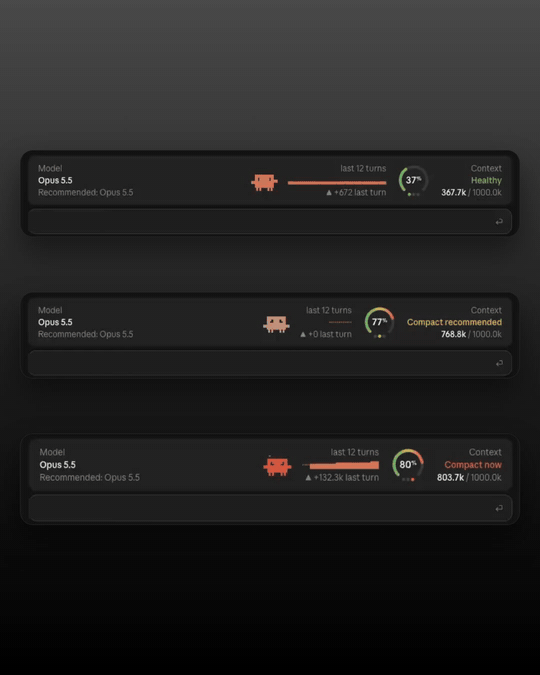

# context-hud

A small weightless side project, built while playing with the new Claude Code mods: a HUD that sits right above the prompt.

<p align="center"></p>

## The model

On the left, the model you're using and a recommended one, based on a simple rule of thumb:

- **Sonnet 5.5** for everyday work
- **Opus 5.5** once the session gets heavy (more than 40 tool calls)
- **The model you're already on** when the context is almost full (75%+): changing model that late means the new one has to reload the whole conversation, so it's better to stay where you are and compact

Haiku and Fable are left out on purpose: Haiku is great for quick, lightweight tasks but it's not the one you'd pick to drive a whole coding session, and Fable is meant for ultra-heavy work and isn't available to everyone.

## The context

On the right, the context window, read from the right edge inward:

- **Status**: `Healthy`, `Compact recommended` or `Compact now`, with the tokens used out of the window (`274.9k / 1000.0k`)
- **Gauge**: borrowed (ok, copied) from the iPhone Duo battery UI: a 270° arc filled with a green → red gradient, the percentage in the middle and three dots below (green, yellow, red) for the current level
- **History**: the context fill at the end of each of the last 12 turns, and how much the last turn added (`▲ +1.2k last turn`)
- **Clawd**, Claude Code's mascot, on its original pixel grid, reacting to the context:

| Context | Status | Clawd |
| --- | --- | --- |
| under 65% | Healthy | happy, hopping around and blinking |
| 65–79% | Compact recommended | sad, crying a pixel tear |
| 80% and over | Compact now | angry, shaking and steaming |

In the **desktop app** the gauge and Clawd are drawn as vector graphics (SVG with SMIL animation). In the **terminal** the same layout is drawn with text: a box gauge, coloured dots and the block-character Clawd.

Mods are a really fun new addition to Claude Code. I'd love to be able to reach even deeper into its UI: the text box, and everything else.

## Requirements

Claude Code **2.1.286 or newer**. The mod is a plugin of *function hooks*, an early-access plugin API that may change between releases.

## Install

Clone the repository somewhere permanent:

```bash
git clone https://github.com/NalettoS/context-hud.git ~/claude-mods/context-hud
```

**For one terminal session:**

```bash
claude --plugin-dir ~/claude-mods/context-hud
```

**For every session, desktop app included:** add the folder to the `env` block of `~/.claude/settings.json`, then start a new session:

```json
{
  "env": {
    "CLAUDE_CODE_PLUGIN_DIRS": "/Users/<your-user>/claude-mods/context-hud",
    "CLAUDE_CODE_ENABLE_FUNCTION_HOOKS": "1"
  }
}
```

Use an absolute path. Separate several mod folders with `:`.

## Optional: the app's own font for the percentage

The gauge sets its percentage in the system font. To match the Claude desktop app exactly, generate the digit outlines from the Anthropic Sans font that ships inside your local Claude.app:

```bash
pip install fonttools
python3 scripts/build-glyphs.py
```

The font belongs to Anthropic and is not distributed here. The script reads it on your machine and writes `hooks/glyphs.ts` for your own install only. Keep that file out of your commits:

```bash
git update-index --skip-worktree hooks/glyphs.ts
```

## How the numbers are computed

- **Tokens and percentage** come from Claude Code itself (`$.session.usage()`), the same figures as the status line: input tokens of the last response against the model's context window. They appear after the first response of a session or after a compaction.
- **History** records the fill at the end of every turn; `·` marks turns not taken yet.
- **Recommended model** is the rule of thumb above, not an official signal.

## Develop

```bash
claude plugin validate .
claude plugin test .
```

`hooks/register.tsx` is the whole mod; `tests/hud.test.tsx` mounts the HUD on the terminal and desktop surfaces.

## License

MIT, see [LICENSE](LICENSE). Claude, Claude Code and Clawd are Anthropic's; this is an unofficial fan project, not affiliated with or endorsed by Anthropic.
